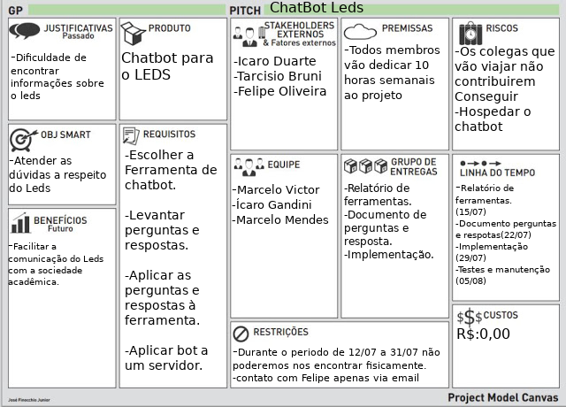

# ChatBotLeds  
## Grupo
1. Professor
   1. Felipe Frechiani Oliveira, email: felipefo@gmail.com
2. Alunos
   1. Ícaro Gandini  Fialho, email: icarog28@gmail.com
   2. Marcelo Victor Barbosa, email: mvfbarbosa99@hotmail.com
   3. Marcelo Passamai Mendes, email: marceloestudoifes@gmail.com
## PMC

## Links 
Link do Trello: [Trello](https://trello.com/b/ZE6Uhkon/chatbot-leds) 
Link do Slack: [Grupo Slack](https://ledsgrupo.slack.com/)  
Documento de perguntas e respostas: [conversas do chat](https://docs.google.com/document/d/1yQLv4uC1yNHV9qTkr_Ogj4hzT1VPrYYxYBfcNsHVfec/edit?usp=sharing)
 
Documento com análise de ferramentas de chatbot: [Ferramentas de chatbot](https://docs.google.com/document/d/1dMu7eDXsxNr2BbwzzS6PMYA1DIthkE8Smkah0gCkCI8/edit?usp=sharing)
 